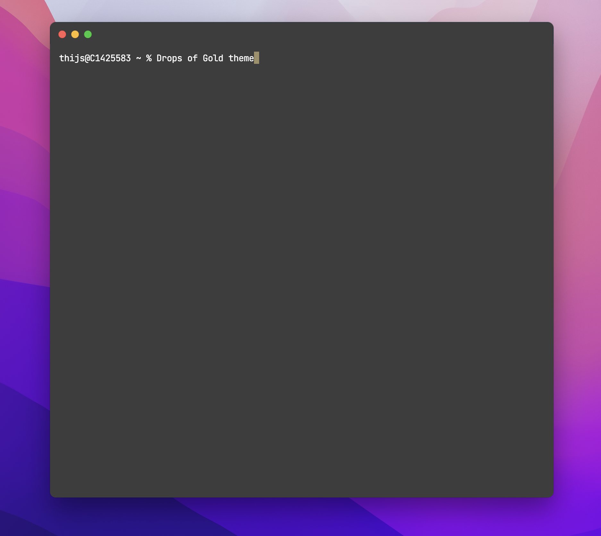

# Drops of Gold Theme for Hyper™

Drops of Gold Theme is a beautiful, fully customizable, theme for the Hyper terminal. Be aware, I no longer maintain this repo.

 

## Install

Installing the Drops of Gold theme for your Hyper terminal couldn't be easier.

##### Inside Your Hyper Terminal

1. `hyper i drops-of-gold-hyper`

#### Manually

1. Open `~/.hyper.js` in your favorite editor.
2. Add `drops-of-gold-hyper` to the `plugins` array.
3. Enjoy Drops of Gold.

 
 

## Configure

Drops of Gold aims to deliver a beautiful experience out of the box. However, you can override the font-family or font-size specified by Drops of Gold.

1. Open `~/.hyper.js` in your favorite editor.
2. Add a `drops-of-gold-hyper` object to the `config` object and specify `fontFamily` and/or `fontSize`.

 
 

## Use of Fonts

I use the gorgious and free JetBrains Mono font. [You can download it from the website.](https://www.jetbrains.com/lp/mono/)

  

## Contribute

1. [Fork](https://help.github.com/articles/fork-a-repo/) this repository to your own GitHub account.
2. [Clone](https://help.github.com/articles/cloning-a-repository/) to your local device: `git clone git@github.com:<your_github_username>/drops-of-gold-hyper.git`
3. Install the dependencies: `npm install`

## Sponsor

Enjoy my Open Source and free work and [don't forget to tip the waiter.](https://github.com/thijswillemmoens/sponsor) ☕

    
&nbsp;<small> Follow me on Twitter</small>

    
&nbsp;<small>Check out my website with interessting articles</small>

    
&nbsp;<small>Connect on LinkedIn</small>

